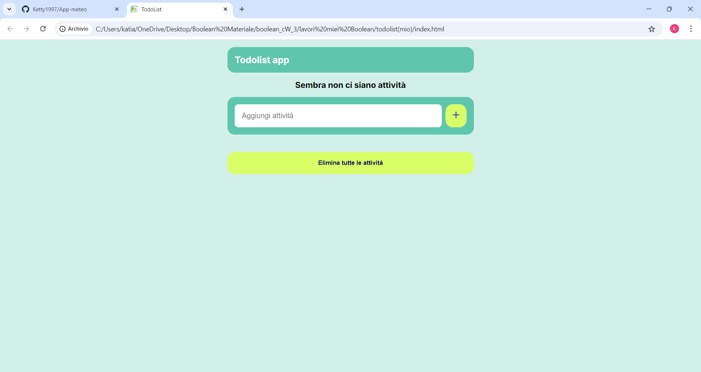
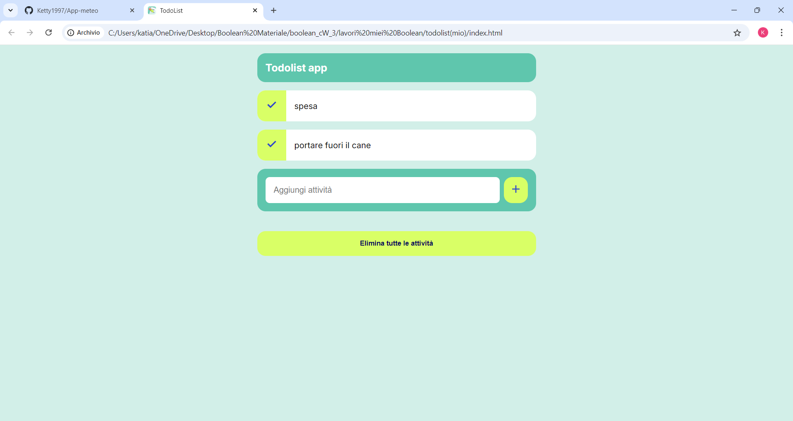

# App todo List

Quest'app e' una todo list dinamica

## Descrizione

Questo progetto è realizzato attraverso l'utilizzo di diverse tecnologie quali html, css ,javascript

## Funzionalità

La web app include le seguenti funzionalità:

- elementi di lista permanenti anche se viene chiusa l'app
- elementi della lista che possono essere eliminati tutti insieme o uno ad uno

## Tecnologie utilizzate

la web app è stata sviluppata utilizzando le seguenti tecnologie:

- HTML
- CSS
- JavaScript

## Licenza

<!-- Questo progetto è stato rilasciato sotto la licenza MIT. Per ulteriori informazioni, leggere il file `LICENSE.md`. -->

## Crediti

Questo progetto è stato sviluppato da Katia Falletti.(https://it.linkedin.com/in/katia-falletti-616890225?trk=people-guest_people_search-card)
